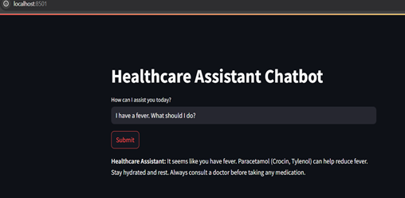
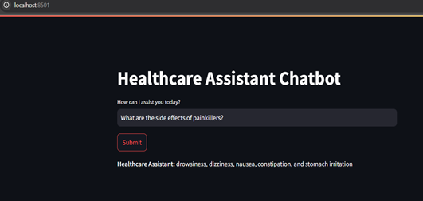
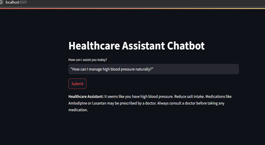

# AI-Powered Health Assistant

**AICTE Internship on AI: Transformative Learning with TechSaksham**  
*A joint CSR initiative of Microsoft & SAP*  

**Author:** A. Mourya  
**Guide:** Jay Rathod  

---

## 📌 Overview
The **AI-Powered Health Assistant** is a chatbot system designed to provide **basic medical guidance**, **appointment scheduling assistance**, and **medication reminders** using **Natural Language Processing (NLP)** and **Machine Learning**.  

It is **not** a replacement for professional healthcare but serves as a **preliminary point of contact** for users seeking quick information or guidance on minor health concerns.

---

## ✨ Features
- 💬 **Medical Inquiry Handling** – Quick responses to common health-related queries.  
- 📅 **Appointment Scheduling Assistance** – Help in booking doctor consultations.  
- 💊 **Medication Reminders** – Reminds users about prescribed medications.  
- 🌐 **Web-based Interface** – Built using Streamlit.  
- 🧠 **AI-Powered NLP** – Uses pre-trained Hugging Face Transformers models.  
- 🌱 **Scalable** – Future-ready for multilingual and telemedicine integration.  

---

## 🚀 Problem Statement
Access to **reliable and timely medical information** is often limited in rural areas, and healthcare systems are **overburdened** with minor queries.

This project addresses:  
- Accessibility gaps in healthcare.  
- Reducing unnecessary doctor visits through automated advice.  
- Assisting with scheduling and medication reminders.  

---

## 🎯 Objectives
- Provide instant medical guidance for basic symptoms and medication queries.  
- Enhance **24/7 healthcare accessibility**.  
- Reduce healthcare system burden by filtering low-priority queries.  
- Assist in appointment scheduling.  
- Improve medication adherence.  
- Offer a user-friendly web interface.  

---

## 🖥 System Design
**Architecture Key Points:**  
- **Frontend:** Streamlit Web Interface  
- **Backend:** Python  
- **NLP & AI Model:** Hugging Face Transformers  
- **Preprocessing:** NLTK (tokenization, stopword removal)  
- **Logic:** Hybrid AI (ML + Rule-Based) for healthcare-specific responses  

---

## 🛠 Tech Stack
**Languages & Libraries**  
- Python 3.11+  
- Streamlit (UI)  
- Transformers (NLP Models)  
- NLTK (Text Processing)  
- Pandas & NumPy (Data Handling)  

**Hardware Requirements**  
- Intel Core i5/i7 or AMD Ryzen 5+  
- 8GB+ RAM (16GB recommended)  
- SSD storage (20GB+ free)  
- Stable Internet connection  

**Software Requirements**  
- OS: Windows / macOS / Linux  
- IDE: VSCode / PyCharm / Jupyter Notebook  
- Python package manager: pip / conda  

---

## 📷 Example Outputs
**User:** `"I have a fever. What should I do?"`  
**Bot:** `"It seems like you have fever. You may use Paracetamol (e.g., Crocin, Tylenol) to reduce fever. Stay hydrated and rest. Always consult a doctor before taking any medication."`   
        
  

**User:** `"What are the side effects of painkillers?"`  
**Bot:** `"Drowsiness, dizziness, nausea, constipation, and stomach irritation. Severe side effects require medical consultation."`  



**User:** `"How can I manage high blood pressure naturally?"`  
**Bot:** `"It seems like you have high blood pressure. Reduce salt intake. Medications like Amlodipine or Losartan may be prescribed by a doctor. Always consult a doctor before taking any medication."` 



---

## 📂 Project Structure
```bash
AI-Powered-Health-Assistant/
│
├── main.py                # Streamlit app entry point
├── requirements.txt       # Python dependencies
├── README.md              # Project Documentation
├── /models                # Pre-trained / fine-tuned models
├── /assets                # Images/Snapshots
└── ...
```

yaml
Copy
Edit

---

## 📥 Installation & Run

**1. Clone the Repository**
```bash
git clone https://github.com/MouryaSagar17/AI-Powered-Health-Assistant.git
cd AI-Powered-Health-Assistant
```
**2. Install Dependencies

```bash
pip install -r requirements.txt
```
**3. Run the Chatbot

```bash
streamlit run main.py
```
**4. Access in Browser
Open: http://localhost:8501

# 🔮 Future Enhancements
✅ More accurate medical responses via verified health databases (WebMD, Mayo Clinic).

✅ Multi-language support.

✅ Context-aware conversation handling.

✅ Voice input/output integration.

✅ Real-time doctor consultation integration.

✅ Mobile app version.

✅ HIPAA/GDPR-compliant data handling.

# 📜 License & Disclaimer
This project is for educational purposes only.
It is not a substitute for professional medical advice, diagnosis, or treatment.
Always consult a qualified healthcare provider for any health concerns.

# 📚 References
Das, S. K., Saha, S. K., & Islam, M. S. Chatbot for Healthcare System Using Artificial Intelligence, IEEE Xplore (2020).

Esteva, A. et al. Dermatologist-level classification of skin cancer with deep neural networks, Nature (2017).

(Other references from report)


---

If you want, I can also **add a badges section** (Python, Streamlit, Hugging Face, License) at the top
